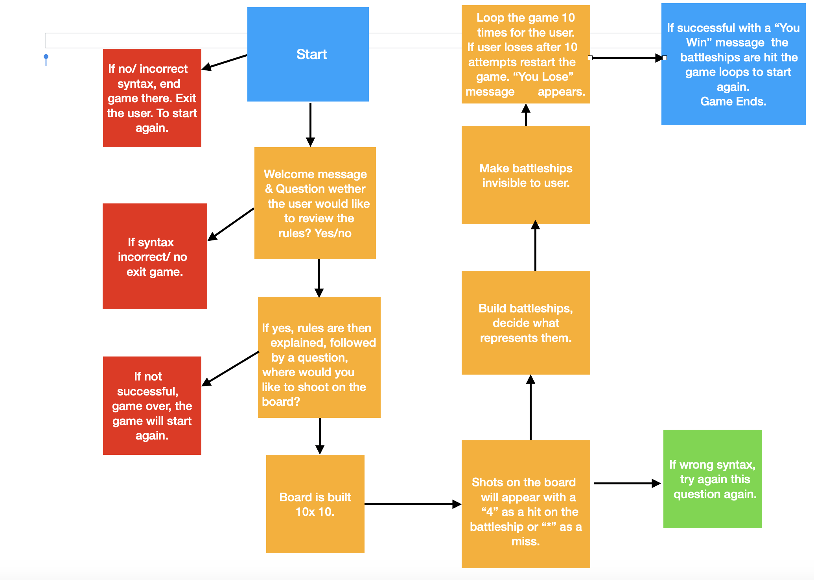

# BATTLESHIPS GAME Portfolio Project 3 - Python Essentials.

Things I've worked on since the last 

User Stories to achieve:

User Sories 

1. Make a board your own size with a Maximum of 8. 
2. Fire shots at the board & decide how they register.
3. Decide how the battleships are represented & randomise hits for each game. 
4. Make Battleships invisble for game.
5. Say if shot isn't on the board with a 'H' for hit or 'M' for miss.
6. Explain the Rules to the User. 
7. Make the flow of the game feel user friendly .
8. Loop the game X 10.
   

Portfolio Project 3 - Python Essentials.
Purpose of the project & description of game created.
=======
- [BATTLESHIPS GAME Portfolio Project 3 - Python Essentials.](#battleships-game-portfolio-project-3---python-essentials)
- [Purpose of the project & description](#purpose-of-the-project---description)
- [Game creation breakdown.](#game-creation-breakdown)
- [Flow chart example -](#flow-chart-example--)
- [Credits](#credits)
- [Testing](#testing)

# Purpose of the project & description.
>>>>>>> 87fb1c317d72b475cf61e685ef71dc0c42442d17

The purpose of this project is to build an interactive brain game for a user to play against the computer.
The game is simple, and repeats in a loop of 10 tries then it restarts.
The grid size is chosen by the user. The maximum it's set to is a grid of 8, if a harder game was to be functioned it could go to 25 for example. 
The rules are explained at the beginning to give the user clear instruction. 
There's 3 battleships placed Invisibly on the board, the user then has 10 tries to hit the battleships with their missile which is represented by a H for hit 
& an M for Miss. 

# Features

## Welcome Message 

A quick, swift intro! The Welcome message goes straight to the point, asking the user if they're ready for the Rules?..

If no...
# Rules

A polite message is left, 
With the rules question still appearing to encourage the user to play. 

If Yes...

The rules are explained in bullet points, four bullet points, keeping the logic short and to the point.

# Grid 
The Grid Size & Game Begins

# Shots 
As you shoot it either gets represented by an M or a H

# Game creation breakdown.

Comments from the code on how it was created. 

 - User Interaction/Rules Section 1.

 - Function for Grid Size Section 2.

 - Grid styling

 - Battleship Placement 

 - User input

 - Hits or Misses

 - Loop game after 10 tries. 
 

# Flow chart example -

# Credits

- Youtube tutorial- Battleships to understand logic. 
- https://www.youtube.com/watch?v=Gi0Fdyhk1_0&t=511s
- Stackoverflow was great resource.
- https://www.w3schools.com/ 
- https://www.geeksforgeeks.org/ understanding how to make battleships invisible 
- Tutors at code Institute
- Slack meet with the September intake.

# Testing

PEP 8

https://extendsclass.com/python-tester.html

https://pep8ci.herokuapp.com/#

Deployment & Error Handling 

